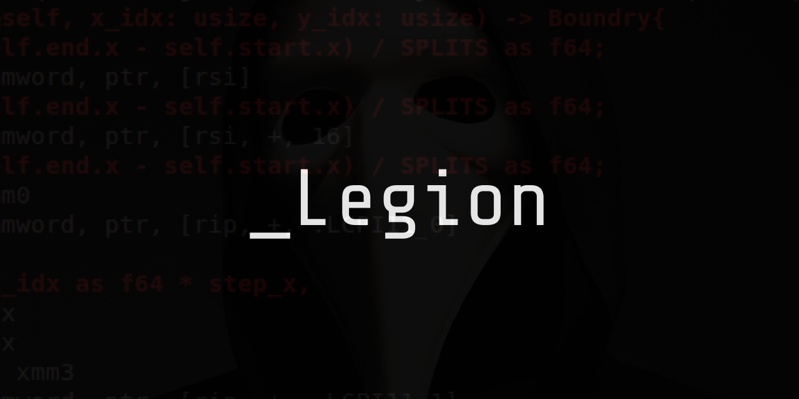

# 🎮 _LEGION

_"We are the echoes of the virtual world, We are LEGION"_



## Introduction 🌐

Welcome to _Legion, a Python-based hacking simulation game that emulates the shadowy underbelly of cyberwarfare. Prepare to immerse yourself in a subculture defined by a new age of cyber renegades and enforcers, where every algorithm can be a weapon, and every line of code is a potential key to a locked, hidden reality. 

Experience the thrill of infiltrating highly secure digital fortresses, outwitting intelligent security systems, and deciphering encrypted data all while being engrossed in a hacker's battlefield. Join the silent war in the digital void, become a part of Legion.

_"We are not just players, We are the game itself"_

## Features 💻

* Intricate, real-world-esque hacking scenarios.
* An array of tools that simulate genuine hacking methodologies.
* In-depth storyline and missions that plunge you into the hacker counterculture.
* Challenging puzzles that will test your code-cracking and problem-solving abilities.
* Engaging multiplayer modes - join forces with your peers and challenge others. (WIP)

## Installation 📥

1. Clone the repository to your local machine.

```bash
git clone https://github.com/0x00ASTRA/_Legion.git
```

2. Navigate to the cloned project directory.

```bash
cd _Legion
```

3. Install the required dependencies.

```bash
pip install -r requirements.txt
```

4. Run the game.

```bash
python3 main.py
```

## Gameplay Guide 🕹️

The world of Legion is deep, dynamic, and designed to keep you on the edge. Hone your skills and outsmart your opponents to climb up the leaderboard. Every mission accomplished is a step closer to becoming a legend in the Legion.

Detailed gameplay guide can be found [here](link-to-the-guide).

## Contributions and Bug Reports 🤝

Legion embraces the very essence of the hacker ethos - collaboration. We are all a part of this digital revolution. Every bug found, every improvement made, brings us closer to the perfect simulation. Feel free to submit bug reports, feature requests, and pull requests!

Before contributing, please read our [Contribution Guidelines](link-to-guidelines) and [Code of Conduct](link-to-conduct).)

## Wallets 🪙

| Icon | Token | Address                                      |
|------| ----- | -------------------------------------------- |
|  | SOL   | 12Ymegdn9Gw27BoE9bkdH7TViDdmj4is1kpM7BWLuD9X |
|  | LTC   | LeiSY4Frv5odEk16FgR6JMPNy7SurHwBN7           |
|  | BTC   | 12kV7ixtjP7W8PowrgwsAQLafX1kzVg4PB           |
|  | ETH   | 0x02c5e2ec62640771851D3BD0c283936A6481e678   |
|  | DOGE  | DLTzZUjJ8WwZ8rHNfeYTLcYALoRGu73s3t           |
|  | NEOX  | GNcbu5GuZKMUui8A9eZxGXhJurgSixNRfT           |
|  | RVN   | RPCyf776AFX2qm3H3v77RnrvtX2QF2f1cg |


## Disclaimer ⚠️

Legion is a game that simulates hacking. All in-game actions and entities are fictional. The use of this software for any malicious or illegal activities is strictly prohibited. The developers of Legion hold no liability for misuse of the game.

## License 📄

Legion is licensed under [MIT License](link-to-license).

## Join the Legion! 🦾

*"In the world of 0s and 1s, we are the outliers, we are _Legion"*

